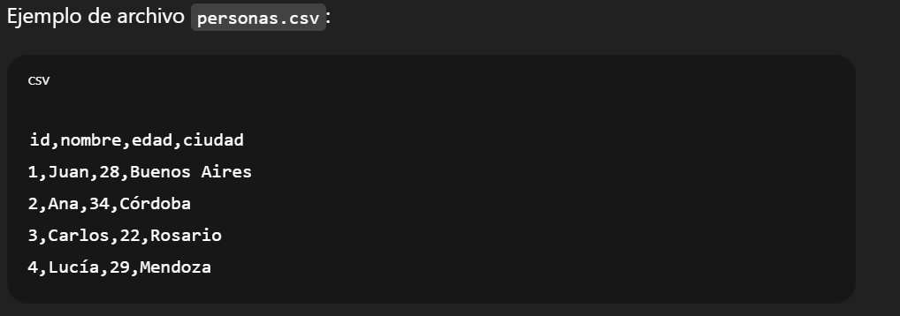

# Investigación en tipos y formatos de datasets

# Equipo 6, Formato CSV

## consignas

- muestre un ejemplo de la codificación
- explique el uso habitual
- presente un ejemplo de código fuente python para acceder y visualizar la información

# Ejemplo de la codificación

Un archivo **CSV (Comma Separated Values)** guarda datos en formato tabular, utiliza dos secciones como protocolo, un encabezado que es la primera fila que determina los nombres de los campos y otra donde cada fila corresponde a un registro y cada columna a un campo, separado por un delimitador( por lo general una coma).



# Uso habitual

 Es uno de los formatos más usados para transferir datos entre aplicaciones (Excel, Google Sheets, bases de datos, sistemas estadísticos) ya que la codificación no utiliza ningún formato pensado para ser procesado por software si no que es texto plano puede abrirse con un editor de texto, hojas de cálculo o software de análisis de datos.

- **Procesamiento automático**: Lenguajes como **Python, R, Java, C#** y otros tienen librerías para leer y manipular CSVs.
- **Limitaciones**:
    - No soporta jerarquías (como JSON o XML).
    - Puede haber problemas si los datos contienen comas, saltos de línea o caracteres especiales (se suelen encerrar entre comillas `"..."`).

# código de lectura y escritura en Python

```python
# para leer el archivo .csv
with open("personas.csv", "r", encoding="utf-8") as f:
lineas = f.readlines()

# Separar encabezados y filas
encabezados = lineas[0].strip().split(",")
filas = [linea.strip().split(",") for linea in lineas[1:]]

# Mostrar contenido
for fila in filas:
    registro = {}
    for i, valor in enumerate(fila):
        registro[encabezados[i]] = valor
    print(registro) # muestra cada fila
```

```python
# Datos en forma de listas de strings
encabezados = ["id", "nombre", "edad", "ciudad"]

filas = [
    ["1", "Juan", "28", "Buenos Aires"],
    ["2", "Ana", "34", "Córdoba"],
    ["3", "Carlos", "22", "Rosario"],
    ["4", "Lucía", "29", "Mendoza"]
]

# Escribir en el archivo CSV
with open("personas.csv", "w", encoding="utf-8") as f:
    # Escribir encabezados
    f.write(",".join(encabezados) + "\n")
    
    # Escribir cada fila
    for fila in filas:
        f.write(",".join(fila) + "\n")
```